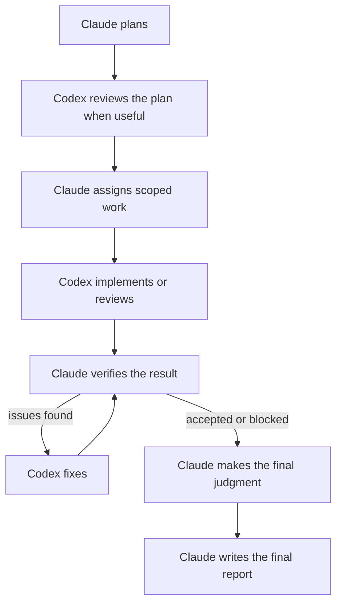

# Plugin Orquestador Claude–Codex


Un plugin para Claude Code que coordina agentes OpenAI Codex. Claude planifica y verifica el trabajo;
Codex se encarga de la implementación y revisión delimitada a través de su CLI.

## Qué hace

Utilice este plugin cuando desee que Claude Code supervise a Codex en lugar de transmitir manualmente el contexto
entre ambas herramientas. Ayuda a Claude a:

- asignar o reanudar agentes de Codex delimitados;
- monitorear agentes activos de Codex;
- preservar los prompts, flujos de eventos y transferencias exactos;
- verificar los resultados de forma independiente y registrar las decisiones importantes.

## ¿Por qué este enfoque?

### 1. Diferentes modelos detectan diferentes errores

Claude y Codex provienen de familias de modelos y entornos de ejecución diferentes, por lo que pueden detectar distintos errores.
El trabajo con conjuntos heterogéneos, incluido [LLM-Blender](https://arxiv.org/abs/2306.02561), [Mixture-of-Agents](https://arxiv.org/abs/2406.04692) y [FrugalGPT](https://arxiv.org/abs/2305.05176), respalda la combinación de modelos distintos mientras advierte contra el acuerdo ciego de la mayoría.
Este plugin solicita a Claude resolver los desacuerdos basándose en evidencia inspeccionable en lugar de votaciones de modelos.

### 2. Claude mantiene el contexto global

Claude rastrea el objetivo general, el historial de agentes, la verificación y las decisiones, mientras que Codex recibe
tareas de ejecución enfocadas. El 
[lanzamiento de contexto de 1M](https://claude.com/blog/1m-context-ga) de Anthropic respalda el uso de Claude para este contexto más amplio.

Las ventanas de contexto grandes no son suficientes por sí solas.
[Context Rot](https://www.trychroma.com/research/context-rot) demuestra que el rendimiento puede disminuir a medida que crece el contexto.
Los prompts duraderos, las transferencias, el estado del repositorio y las entradas del diario preservan el contexto que importa.

### 3. Los entornos nativos importan

El rendimiento de un agente depende de más que el modelo subyacente.
El acceso a shell y archivos, el historial de sesiones, las aprobaciones, la contención (sandboxing), los flujos de eventos y los prompts específicos del entorno afectan el resultado.
El [ranking de Terminal-Bench 2.1](https://www.tbench.ai/leaderboard/terminal-bench/2.1) refleja esto al evaluar pares de agente y modelo en lugar de modelos de forma aislada.
El plugin, por lo tanto, permite que Codex trabaje a través de su CLI nativo mientras Claude se mantiene en Claude Code como planificador, orquestador y revisor.

## Requisitos

- [Claude Code](https://code.claude.com/docs/en/overview) en un IDE o terminal.
- [OpenAI Codex CLI](https://developers.openai.com/codex/cli/reference).
- Python 3.10 o posterior para las herramientas incluidas.
- Un repositorio Git.
- Una ruta de verificación significativa, como pruebas, typecheck, lint, compilación, benchmark, captura de pantalla o
  inspección manual.

## Instalación

Desde Claude Code:

```text
/plugin marketplace add alexzh3/codex-orchestrator
/plugin install codex-orchestrator@codex-orchestrator
/reload-plugins
```

## Uso

Use `orchestrate` para una fase enfocada y `workflow` para el proceso completo de extremo a extremo.

| Comando | Propósito |
| --------------------------------------- | ---------------------------------------------------------------------------------- |
| `/codex-orchestrator:orchestrate` | Ejecutar una fase enfocada de ejecución, revisión, monitoreo o verificación dentro de una corrida. |
| `/codex-orchestrator:workflow` | Ejecutar desde la planificación hasta la ejecución, verificación, cierre e informe. |
| `/codex-orchestrator:report` | Generar `report.md` a partir de una corrida ya cerrada. |

Por ejemplo, para revisar un cambio dentro de una corrida existente:

```text
/codex-orchestrator:orchestrate

In run <run-id>, have a fresh Codex agent review commit <sha> against its task requirements.
Do not modify the target. Independently verify every material finding.
```

Las instrucciones de operación se encuentran en [`skills/orchestrate/SKILL.md`](skills/orchestrate/SKILL.md),
[`skills/workflow/SKILL.md`](skills/workflow/SKILL.md) y
[`skills/report/SKILL.md`](skills/report/SKILL.md).

## Flujo de trabajo

El comando `/codex-orchestrator:workflow` ejecuta este flujo completo, desde la planificación y ejecución delimitada
hasta la verificación y generación de informes:



## Estructura de la corrida

Las corridas se almacenan bajo `.codex-orchestrator/runs/<run-id>/`. Antes de crear una corrida, el flujo de trabajo agrega
`/.codex-orchestrator/` al `.git/info/exclude` local del repositorio y verifica que esté ignorado;
no modifica el `.gitignore` rastreado.

```text
journal.jsonl
codex-impl-01/
  execution-01/
    prompt.md
    events.jsonl
    handoff.md
evidence/                 # optional
report.md                 # written by Claude after run closure
```

Cada directorio de agente de nivel superior es un contexto de ejecución persistente. Cada prompt, flujo de eventos y
ciclo de transferencia obtiene la siguiente ejecución numerada; reanudar una sesión nativa crea otra ejecución
bajo el mismo agente. Cada ejecución mantiene el prompt exacto, los eventos sin procesar de Codex y la transferencia final
juntos para que cada ejecución pueda inspeccionarse más tarde.

`journal.jsonl` es el índice compacto de la corrida, `evidence/` contiene evidencia de apoyo opcional,
y `report.md` incluye el resumen final de Claude. El formato detallado del diario, los límites de confianza y
el flujo de cierre están documentados en [`docs/orchestration-contract.md`](docs/orchestration-contract.md).

## Benchmarks históricos v0.4.1

| Configuración | Régimen | Aprobados |
| --- | --- | ---: |
| Plugin v0.4.1 | Sin tiempo límite | **9/10** |
| Claude Code en solitario | Con tiempo límite | 8/10 |
| Codex en solitario | Con tiempo límite | 8/10 |

Estos resultados históricos son direccionales, no estadísticamente confiables ni comparables directamente: cada
configuración se ejecutó solo una vez por tarea, el plugin no tenía tiempo límite mientras que las líneas base individuales sí, y la versión v0.5.0 con prioridad en prompts no ha sido evaluada. Consulte
[`docs/benchmarks.md`](docs/benchmarks.md) para conocer la metodología y las limitaciones.

## Limitaciones

- Los bucles de revisión y corrección secuenciales pueden tardar más que usar un solo agente.
- El trabajo en paralelo requiere archivos, recursos o worktrees aislados.
- Las conclusiones son tan confiables como las verificaciones y la evidencia disponibles.

## Seguridad y privacidad

Este plugin respalda la autonomía limitada, no la ejecución sin restricciones. Use `workspace-write` para el trabajo normal
de Codex y requiera autorización explícita para acceso a la red, escrituras fuera del espacio de trabajo, acceso al socket de Docker,
despliegues, credenciales o computación costosa. El acceso amplio debe estar en un contenedor o VM confiable
y endurecido externamente.

El plugin no agrega telemetría propia. El manejo de datos sigue los entornos configurados de Claude Code y Codex,
que pueden inspeccionar archivos, prompts, flujos de eventos, diffs, salida de comandos y evidencia
que haga disponibles. Mantenga secretos, credenciales, claves privadas, archivos `.env` y datos sensibles de producción
fuera del alcance, a menos que haya configurado intencionalmente el acceso.
