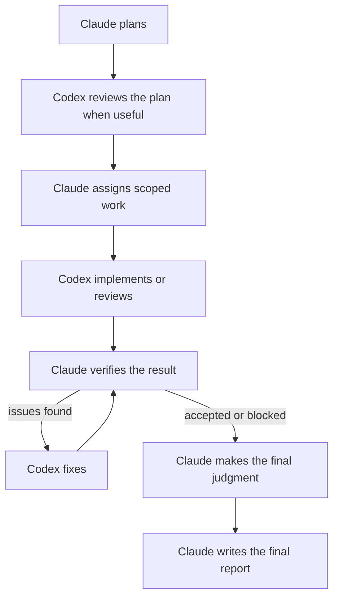

# Claude–Codex Orchestrator Plugin

A Claude Code plugin for coordinating OpenAI Codex sessions. Claude plans and verifies the work;
Codex handles scoped implementation and review in its native CLI or IDE.

## What It Does

Use this plugin when you want Claude Code to supervise Codex rather than manually relay context
between the two tools. It helps Claude:

- assign or resume scoped Codex agents;
- monitor CLI and IDE sessions;
- preserve exact prompts, event streams, and handoffs;
- independently verify results and record consequential decisions.

## Why This Approach?

### 1. Different Models Catch Different Mistakes

Claude and Codex come from different model families and harnesses, so they can catch different mistakes.
Work on heterogeneous ensembles—including [LLM-Blender](https://arxiv.org/abs/2306.02561), [Mixture-of-Agents](https://arxiv.org/abs/2406.04692), and [FrugalGPT](https://arxiv.org/abs/2305.05176)—supports combining distinct models while warning against blind majority agreement.
This plugin asks Claude to resolve disagreements from inspectable evidence rather than model votes.

### 2. Claude Maintains Global Context

Claude tracks the overall goal, agent history, verification, and decisions while Codex receives
focused execution tasks. Anthropic's
[1M context release](https://claude.com/blog/1m-context-ga) supports using Claude for this broader
context.

Large context windows are not enough on their own.
[Context Rot](https://www.trychroma.com/research/context-rot) shows that performance can decline as context grows.
Durable prompts, handoffs, repository state, and journal entries preserve the context that matters.

### 3. Native Harnesses Matter

Agent performance depends on more than the underlying model.
IDE context, shell and file access, session history, approvals, sandboxing, event streams, and harness-specific prompting all affect the result.
The [Terminal-Bench 2.1 leaderboard](https://www.tbench.ai/leaderboard/terminal-bench/2.1) reflects this by evaluating agent-and-model pairs rather than models in isolation.
The plugin therefore lets Codex work through its native CLI or IDE while Claude remains in Claude Code as planner, orchestrator, and reviewer.

## Requirements

- [Claude Code](https://code.claude.com/docs/en/overview) in an IDE or terminal.
- [OpenAI Codex](https://developers.openai.com/codex/cli/reference) in an IDE or through the CLI.
- Python 3.10 or newer for the bundled session tools.
- Git when branch or worktree isolation is needed.
- A meaningful verification path such as tests, typecheck, lint, build, benchmark, screenshot, or
  manual inspection.

## Installation

From Claude Code:

```text
/plugin marketplace add alexzh3/codex-orchestrator
/plugin install codex-orchestrator@codex-orchestrator
/reload-plugins
```

## Usage

Use `orchestrate` for one focused phase and `workflow` for the complete end-to-end process.

| Command | Purpose |
| --------------------------------------- | ---------------------------------------------------------------------------------- |
| `/codex-orchestrator:orchestrate` | Run a focused task, such as implementation, review, monitoring, or verification. |
| `/codex-orchestrator:workflow` | Run planning through execution, verification, closure, and report. |
| `/codex-orchestrator:report` | Author `report.md` from an already closed run. |

To plan, implement, review, and report on a change:

```text
/codex-orchestrator:workflow

Plan and implement <feature>.
Have another Codex agent review the result when useful.
Verify it and produce the final report.
```

To monitor an existing IDE session, start it in VS Code or Cursor, copy its URL, and ask Claude:

```text
/codex-orchestrator:orchestrate

Monitor and review this session:
codex://threads/<thread-uuid>
```

The operating instructions live in [`skills/orchestrate/SKILL.md`](skills/orchestrate/SKILL.md),
[`skills/workflow/SKILL.md`](skills/workflow/SKILL.md), and
[`skills/report/SKILL.md`](skills/report/SKILL.md). Slash-command files only load these skills.

## Workflow

The `/codex-orchestrator:workflow` command runs this full flow, from planning and scoped execution
through verification and reporting:



## Run Layout

Runs live under `.codex-orchestrator/runs/<run-id>/` and are normally ignored by Git:

```text
journal.jsonl
agents/
  codex-impl-01/
    execution-01/
      prompt.md
      events.jsonl
      handoff.md
evidence/                 # optional
report.md                 # written by Claude after run closure
```

Each agent directory is a persistent execution context. Every prompt, event stream, and handoff
cycle gets the next numbered execution; resuming a native session creates another execution under
the same agent. Each execution keeps the exact prompt, raw Codex events, and final handoff together
so that each execution can be inspected later.

`journal.jsonl` is the compact index for the run, `evidence/` holds optional supporting evidence,
and `report.md` contains Claude's final summary. The detailed journal format, trust boundaries, and
closure flow are documented in [`docs/orchestration-contract.md`](docs/orchestration-contract.md).

## Benchmarks

With its time limit lifted, the orchestrator passed 9 of the 10 benchmark tasks. The timed solo
Claude Code and solo Codex baselines passed 8/10 each:

| Configuration | Regime | Passed |
| --- | --- | ---: |
| Orchestrator | No timeout | **9/10** |
| Solo Claude Code | Timed | 8/10 |
| Solo Codex | Timed | 8/10 |

The solo runs were not repeated without a time limit, so this comparison separates the
orchestrator's latency from its eventual task success rather than providing a like-for-like speed
comparison. These results are directional, not statistically conclusive: each configuration was
run only once per task, and the available compute budget did not allow repeated trials.

Results, limitations, and methodology are documented in
[`docs/benchmarks.md`](docs/benchmarks.md).

## Limitations

- Sequential review and fix loops may take longer than using one agent.
- Parallel work requires isolated files, resources, or worktrees.
- Conclusions are only as reliable as the available checks and evidence.

## Security And Privacy

This plugin supports bounded autonomy, not unrestricted execution. Use `workspace-write` for normal
Codex work and require explicit authorization for network access, out-of-workspace writes, Docker
socket access, deployments, credentials, or expensive compute. Broad access belongs in a trusted,
externally hardened container or VM.

The plugin adds no telemetry of its own. Data handling follows the configured Claude Code and Codex
environments, which may inspect files, prompts, event streams, diffs, command output, and evidence
you make available. Keep secrets, credentials, private keys, `.env` files, and sensitive production
data out of scope unless you intentionally configured access.
