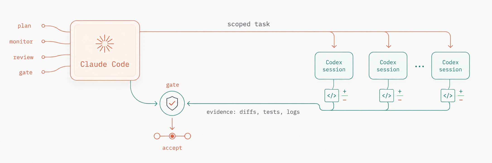
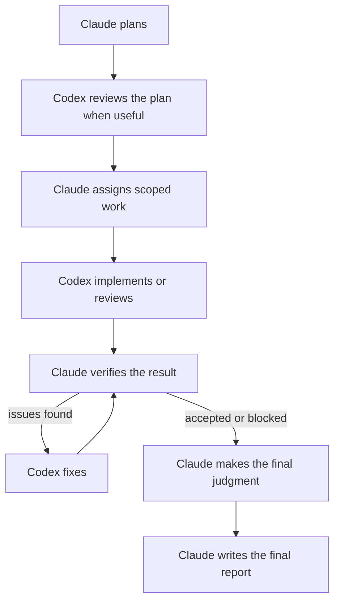

# Claude–Codex Orchestrator Plugin



A Claude Code plugin for coordinating OpenAI Codex agents. Claude owns the plan and verifies the
work; Codex provides optional planning input and handles scoped implementation and review through
its CLI.

## What It Does

Use this plugin when you want Claude Code to supervise Codex rather than manually relay context
between the two tools. It helps Claude:

- assign or resume scoped Codex agents;
- request independent Codex planning or plan review when it materially reduces risk;
- monitor active Codex agents;
- preserve exact prompts, event streams, and handoffs;
- independently verify results and record consequential decisions.

## Why This Approach?

### 1. Different Models Catch Different Mistakes

Claude and Codex come from different model families and harnesses, so they can catch different mistakes.
Work on heterogeneous ensembles—including [LLM-Blender](https://arxiv.org/abs/2306.02561), [Mixture-of-Agents](https://arxiv.org/abs/2406.04692), and [FrugalGPT](https://arxiv.org/abs/2305.05176)—supports combining distinct models while warning against blind majority agreement.
This plugin asks Claude to resolve disagreements from inspectable evidence rather than model votes.

### 2. Claude Maintains Global Context

Claude tracks the overall goal, agent history, verification, and decisions while Codex receives
focused execution tasks. Anthropic's
[1M context release](https://claude.com/blog/1m-context-ga) supports using Claude for this broader
context.

Large context windows are not enough on their own.
[Context Rot](https://www.trychroma.com/research/context-rot) shows that performance can decline as context grows.
Durable prompts, handoffs, repository state, and journal entries preserve the context that matters.

### 3. Native Harnesses Matter

Agent performance depends on more than the underlying model.
Shell and file access, session history, approvals, sandboxing, event streams, and harness-specific prompting all affect the result.
The [Terminal-Bench 2.1 leaderboard](https://www.tbench.ai/leaderboard/terminal-bench/2.1) reflects this by evaluating agent-and-model pairs rather than models in isolation.
The plugin therefore lets Codex work through its native CLI while Claude remains in Claude Code as planner, orchestrator, and reviewer.

## Requirements

- [Claude Code](https://code.claude.com/docs/en/overview) in an IDE or terminal.
- [OpenAI Codex CLI](https://developers.openai.com/codex/cli/reference).
- Python 3.10 or newer for the bundled tools.
- A Git repository.
- A meaningful verification path such as tests, typecheck, lint, build, benchmark, screenshot, or
  manual inspection.

## Installation

From Claude Code:

```text
/plugin marketplace add alexzh3/codex-orchestrator
/plugin install codex-orchestrator@codex-orchestrator
/reload-plugins
```

## Usage

Use `orchestrate` for one focused phase and `workflow` for the complete end-to-end process.

| Command | Purpose |
| --------------------------------------- | ---------------------------------------------------------------------------------- |
| `/codex-orchestrator:orchestrate` | Run a focused execution, review, monitoring, or verification phase within a run. |
| `/codex-orchestrator:workflow` | Run planning through execution, verification, closure, and report. |
| `/codex-orchestrator:report` | Author `report.md` from an already closed run. |

For example, to review a change within an existing run:

```text
/codex-orchestrator:orchestrate

In run <run-id>, have a fresh Codex agent review commit <sha> against its task requirements.
Do not modify the target. Independently verify every material finding.
```

The operating instructions live in [`skills/orchestrate/SKILL.md`](skills/orchestrate/SKILL.md),
[`skills/workflow/SKILL.md`](skills/workflow/SKILL.md), and
[`skills/report/SKILL.md`](skills/report/SKILL.md).

## Workflow

The `/codex-orchestrator:workflow` command runs this full flow, from planning and scoped execution
through verification and reporting:



## Run Layout

Runs live under `.codex-orchestrator/runs/<run-id>/`. Before creating a run, the workflow adds
`/.codex-orchestrator/` to the repository's local `.git/info/exclude` and verifies it is ignored;
it does not modify the tracked `.gitignore`.

```text
journal.jsonl
codex-impl-01/
  execution-01/
    prompt.md
    events.jsonl
    handoff.md
evidence/                 # optional
report.md                 # written by Claude after run closure
```

Each top-level agent directory is a persistent execution context. Every prompt, event stream, and
handoff cycle gets the next numbered execution; resuming a native session creates another execution
under the same agent. Each execution keeps the exact prompt, raw Codex events, and final handoff
together so that each execution can be inspected later.

Planning and plan-review agents are optional, fresh, read-only sessions. They advise Claude; they
do not replace Claude's responsibility to finalize the plan, verify repository evidence, and make
the closing judgment.

`journal.jsonl` is the compact index for the run, `evidence/` holds optional supporting evidence,
and `report.md` contains Claude's final summary. The detailed journal format, trust boundaries, and
closure flow are documented in [`docs/orchestration-contract.md`](docs/orchestration-contract.md).

## Optional Role Configuration

Role configuration is opt-in; the plugin does not create a role configuration implicitly. Without
it, Codex uses its native `config.toml` and built-in defaults unchanged. Generate a repository
config explicitly with:

```bash
python3 "${CLAUDE_PLUGIN_ROOT}/scripts/codex_orch_tools.py" config init --repo <repo>
```

This creates `.codex-orchestrator/config.ini` without overwriting an existing file and locally
excludes `/.codex-orchestrator/` from Git. Its generated defaults are:

| Role | Prefix | Default model | Default allowed efforts | Default speed | Purpose |
| --- | --- | --- | --- | --- | --- |
| `implementation` | `codex-impl-NN` | `gpt-5.6-sol` | `xhigh`, `max`, `ultra` | `fast` | Implement scoped work and focused fixes. |
| `review` | `codex-review-NN` | `gpt-5.6-sol` | `max`, `ultra` | `fast` | Independently review an implementation. |
| `planning` | `codex-plan-NN` | `gpt-5.6-sol` | `max`, `ultra` | `fast` | Propose an independent approach. |
| `planning_review` | `codex-plan-review-NN` | `gpt-5.6-sol` | `max`, `ultra` | `fast` | Critique Claude's draft plan. |

These values correspond to `model = gpt-5.6-sol` and `speed = fast`. Users may edit the file
directly. Every role and its effort list is required; efforts must be a nonempty, ordered, unique
subset of `low`, `medium`, `high`, `xhigh`, `max`, and `ultra`. Model and speed may be omitted to
inherit native Codex behavior or overridden per role. `speed = default` forces Codex's
Standard/default tier, while `speed = fast` enables Fast mode. Extra keys and other speed values are
rejected. Claude selects one allowed effort per execution based on difficulty, breadth, and context.

## Historical v0.4.1 Benchmarks

| Configuration | Regime | Passed |
| --- | --- | ---: |
| Plugin v0.4.1 | No timeout | **9/10** |
| Solo Claude Code | Timed | 8/10 |
| Solo Codex | Timed | 8/10 |

These historical results are directional, not statistically reliable or like-for-like: each
configuration ran only once per task, the plugin had no timeout while the solo baselines were
timed, and prompt-first v0.5.0 has not been evaluated. See
[`docs/benchmarks.md`](docs/benchmarks.md) for the methodology and limitations.

## Limitations

- Sequential review and fix loops may take longer than using one agent.
- Parallel work requires isolated files, resources, or worktrees.
- Conclusions are only as reliable as the available checks and evidence.

## Security And Privacy

This plugin supports bounded autonomy, not unrestricted execution. Use `workspace-write` for normal
Codex work and require explicit authorization for network access, out-of-workspace writes, Docker
socket access, deployments, credentials, or expensive compute. Broad access belongs in a trusted,
externally hardened container or VM.

The plugin adds no telemetry of its own. Data handling follows the configured Claude Code and Codex
environments, which may inspect files, prompts, event streams, diffs, command output, and evidence
you make available. Keep secrets, credentials, private keys, `.env` files, and sensitive production
data out of scope unless you intentionally configured access.
