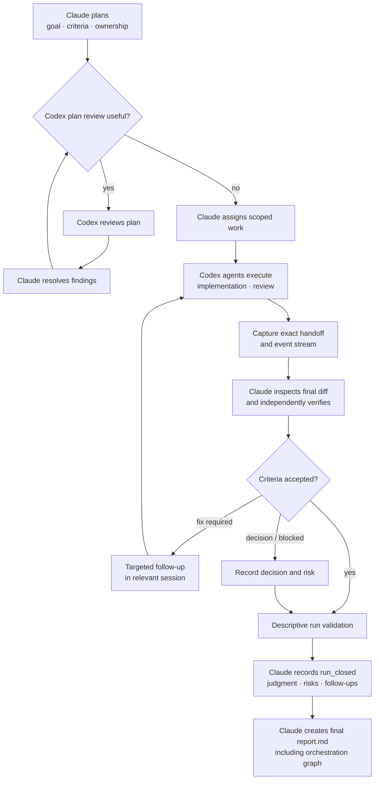

# Claude–Codex Orchestrator Plugin

A prompt-first Claude Code plugin for coordinating OpenAI Codex sessions. Claude scopes the work,
starts or resumes Codex agents, monitors their native event streams, checks their claims against the
repository, records concise decisions, and authors the final report.

## What It Does

Use this plugin when you want Claude Code to supervise Codex rather than manually relaying context
between the two tools. It helps Claude:

- assign scoped implementation or review work to reusable Codex agents;
- attach to IDE sessions from `codex://threads/<thread-uuid>`;
- monitor headless JSONL and external IDE rollout streams without loading full logs;
- coordinate sequential or parallel agents without overlapping file ownership;
- preserve exact prompts, raw event streams, and compact agent handoffs;
- independently verify material claims and record consequential decisions;
- author a final report and Mermaid orchestration graph from the complete run context.

Claude remains the planner, orchestrator, and final reviewer. Codex works as a scoped implementer or
peer reviewer in its native harness.

## Requirements

- [Claude Code](https://code.claude.com/docs/en/overview) in an IDE or terminal.
- [OpenAI Codex](https://developers.openai.com/codex/cli/reference) in an IDE or through the CLI.
- Git when branch or worktree isolation is needed.
- A meaningful verification path such as tests, typecheck, lint, build, benchmark, screenshot, or
  manual inspection.

## Installation

From Claude Code:

```text
/plugin marketplace add alexzh3/codex-orchestrator
/plugin install codex-orchestrator@codex-orchestrator
/reload-plugins
```

## Usage

Use `orchestrate` for a focused assignment, monitor, review, decision, handoff, or compute-gating
phase:

```text
/codex-orchestrator:orchestrate

Give Codex a scoped implementation task, reuse a relevant session if one exists, monitor it, then
independently check its material claims before accepting the result.
```

Use `workflow` for one complete durable run:

```text
/codex-orchestrator:workflow
```

To monitor an existing IDE session, start it in VS Code or Cursor, copy its URL, and ask Claude:

```text
/codex-orchestrator:orchestrate

Monitor and review this session:
codex://threads/<thread-uuid>
```

Headless sessions started with `codex exec` are CLI-resumable but do not appear in the IDE sidebar.

### Commands

| Command | Purpose |
| --- | --- |
| `/codex-orchestrator:orchestrate` | Run a focused orchestration phase. |
| `/codex-orchestrator:workflow` | Run planning through execution, verification, closure, and report. |
| `/codex-orchestrator:report` | Author `report.md` from an already closed run. |

The operating instructions live in [`skills/orchestrate/SKILL.md`](skills/orchestrate/SKILL.md),
[`skills/workflow/SKILL.md`](skills/workflow/SKILL.md), and
[`skills/report/SKILL.md`](skills/report/SKILL.md). Slash-command files only load these skills.

## Full Workflow



## Runtime Contract

Runs live under `.codex-orchestrator/runs/<run-id>/` and are normally ignored by Git:

```text
ledger.jsonl
agents/
  codex-impl-01/
    execution-01/
      prompt.md
      events.jsonl
      handoff.md
evidence/                 # optional
report.md                 # written by Claude after run closure
```

An agent directory is a persistent execution context. Each prompt/execution/handoff cycle gets the
next numbered execution directly beneath it. Resuming a native session creates another execution for
the same agent; starting a fresh session creates another agent.

- `prompt.md` is the exact immutable input sent for the execution.
- `events.jsonl` is raw Codex output for monitoring and debugging.
- `handoff.md` is the exact final agent response.
- `evidence/` stores only material observations that are too large, binary, disputed, or important
  to keep inline.
- `ledger.jsonl` is Claude's concise append-only workflow journal and navigation index.
- `report.md` is Claude's final synthesis, not evidence.

The ledger is canonical for Claude's recorded chronology, task state, and decisions. It is not
independent evidence that a process completed, a claim is true, or code was delivered.

For IDE sessions, the ledger references the absolute external rollout path rather than copying it.
Attaching only to observe an already-active IDE session uses `mode: "observe"` and may omit
`prompt`, because Claude sent none; any later follow-up gets a normal prompted execution. Claude
agents may have no raw event stream when their harness does not expose one.

### Headless Capture

Headless Codex writes the raw event stream and exact handoff directly:

```bash
EXECUTION_DIR=".codex-orchestrator/runs/<run-id>/agents/codex-impl-01/execution-01"
codex exec --json --output-last-message "$EXECUTION_DIR/handoff.md" \
  - \
  < "$EXECUTION_DIR/prompt.md" \
  > "$EXECUTION_DIR/events.jsonl"
```

### Ledger Vocabulary

The ledger deliberately has seven event types:

1. `run_started`
2. `task`
3. `execution`
4. `execution_result`
5. `verification`
6. `decision`
7. `run_closed`

Claude appends `execution` before launch, then records a matching terminal `execution_result` as
complete, blocked, or failed after inspecting the outcome. This is workflow memory rather than
mechanical telemetry. Agent completion does not complete the task; Claude first checks the actual
result and acceptance criteria. The latest `task` record carries its current status.

Validation is a small descriptive close check for readable records, lifecycle pairing, declared
files, terminal task state, and visible non-passing checks. It is deliberately not a complete event
schema and does not judge implementation truth. Claude makes the semantic `run_closed.judgment` of
`passed` or `blocked`. See
[`docs/consensus-and-reviews.md`](docs/consensus-and-reviews.md) for recommended event fields and a
worked fix/rerun example; the workflow skill owns the end-to-end close procedure.

## Claims, Evidence, And Verification

A handoff tells Claude what an agent claims it changed, checked, or could not finish. It is evidence
of the agent's statement, not evidence that the statement is correct.

Evidence is an inspectable observation supporting or contradicting a verification or decision:
actual diffs, command results, screenshots, metrics, or grounded review observations. Claude reads
the compact handoff first, inspects the repository, and independently checks material claims. Raw
event streams are fallback material for monitoring, disputes, or debugging—not the normal source
of test evidence.

Use authority by claim type: prompts record assigned scope; handoffs record agent claims; event
streams record harness activity; verification and evidence record Claude's checks; the ledger
records workflow chronology and decisions; and the final repository state and diff determine what
was actually delivered. Surface conflicts rather than silently preferring one source.

Failed checks remain in history. A fix and passing rerun get new records, and a `decision` explains
the outcome without pretending the earlier failure did not happen. Decision outcomes are
`consensus`, `claude_decision`, or `user_action_required`.

## Monitoring And Parallel Work

The bundled parser classifies Codex event streams and reads incremental tails. The monitor uses
Claude-recorded `run_started`, `run_closed`, and execution-result markers to discover likely active
runs and in-flight executions, then reads their event streams for compact completion, failure, or
stale notifications. It never writes the ledger; ambiguous lifecycle state requires direct
inspection.

Before parallel execution, tasks declare allowed/owned file paths or globs in `files`. An execution
result's `files_changed` is Claude's compact attribution note; inspect the repository diff for the
actual delivered paths. Work may run concurrently only when task paths and shared resources are
disjoint; otherwise Claude serializes the work or uses native Git worktrees. See the monitoring and
compute references under `skills/orchestrate/references/`.

## Final Report

For a closed run, Claude creates the final `report.md` once using exactly:

1. Summary
2. Changes
3. Orchestration Graph
4. Consensus
5. Final Results

Final Results contains Gate Result and Risks / Follow-ups. The Mermaid graph presents the causal
overview of agents, important verification and decisions, deliverables, fix loops, and final state.
Claude authors the complete report and graph directly from the closed run.

## Historical Benchmarks

The retained v0.4.1 benchmark compared ten difficult OpenThoughts-TBLite / Terminal-Bench-style
tasks. The timed harness result was 8/10 for solo Claude, 8/10 for solo Codex, and 6/10 for the
orchestrator; lifting the timeout raised the orchestrator to 9/10. Each cell was one run, so the
result is directional rather than statistical.

These results describe the older protocol implementation and are not generated by the current
runtime. See [`docs/benchmarks.md`](docs/benchmarks.md) and the external
[`codex-orchestrator-bench`](https://github.com/alexzh3/codex-orchestrator-bench) repository for the
archived data and methodology.

## Why Heterogeneous Review?

Claude and Codex come from different model families and harnesses, so they can expose different
failure modes. Work on heterogeneous ensembles—including
[LLM-Blender](https://arxiv.org/abs/2306.02561),
[Mixture-of-Agents](https://arxiv.org/abs/2406.04692), and
[FrugalGPT](https://arxiv.org/abs/2305.05176)—supports combining distinct models, while also warning
against blind majority agreement. This plugin therefore asks Claude to resolve disagreements from
inspectable evidence rather than model votes.

Durable context also mitigates long-context degradation: exact prompts, handoffs, repository state,
and concise ledger records remain available without repeatedly loading entire session transcripts.

## Limitations

- Review and fix loops are often sequential, so orchestration may take longer than a solo agent.
- The Claude-authored ledger improves recovery and traceability but cannot prove lifecycle facts,
  implementation claims, or semantic judgments; Claude must inspect the relevant sources and run
  appropriate checks.
- Raw event streams can be large. Normal review relies on compact handoffs and parser summaries.
- Parallel work requires genuinely disjoint files and resources or separate worktrees.

## Security And Privacy

This plugin supports bounded autonomy, not unrestricted execution. Use `workspace-write` for normal
Codex work and require explicit authorization for network access, out-of-workspace writes, Docker
socket access, deployments, credentials, or expensive compute. Broad access belongs in a trusted,
externally hardened container or VM.

The plugin itself does not collect or transmit user data. Claude Code and Codex may inspect files,
prompts, event streams, diffs, command output, and evidence you make available to their respective
environments. Keep secrets, credentials, private keys, `.env` files, and sensitive production data
out of scope unless you intentionally configured access.
