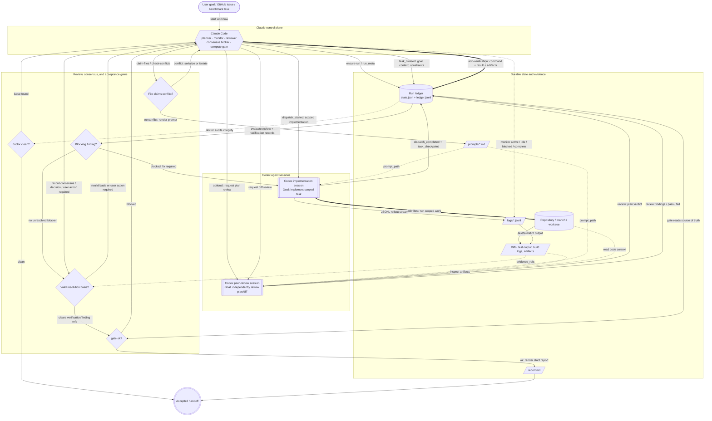

# Orchestration Graph

The generated `## Orchestration Graph` in `report.md` is an agentic trace graph of the run ledger.

> Edges are actions only when the action is transient. Nodes are artifacts when the result must be
> inspected, cited, cleared, or replayed. Agent nodes are active reasoning entities; consensus is a
> resolution gate, not an agent (a consensus record can mean agreement, a Claude decision, or user
> action required).

## Shape Grammar

| Shape | Generated node | Meaning |
| --- | --- | --- |
| Hexagon | `A_CLAUDE{{"Claude Code planner · orchestrator"}}` | Claude control plane. |
| Subroutine | `A_<SLUG>[["agent model · effort mode · status"]]` | Non-hub Codex agent session. |
| Rectangle | `T_<slug>["task_id: compact title (status)"]` | Task artifact from task ledger records. Titles are compacted; ids and status stay visible. |
| Parallelogram | `V<n>[/"Vn · kind: result"/]`, `R<n>[/"Rn · kind review: result reviewer-or-run-wide"/]` | Evidence that can be inspected, cited, cleared, or replayed. |
| Diamond | `C<n>{"consensus: outcome"}`, `G{"gate: ok"}` | Consensus and gate decisions. |
| Triple circle | `DONE((("run accepted")))` | Accepted terminal state when the latest gate passes. |

## Edge Grammar

| Edge | Ledger event label | Meaning |
| --- | --- | --- |
| `-->` | `task_created`, `dispatch_started`, `review`, `consensus`, gate transitions | Transient orchestration action. |
| `==>` | `task_checkpoint`, `dispatch_completed`, `add_verification` | State-changing work or recorded verification. |
| `-.->` | `clears`, `reviews`, `covers` | Read-only citation from evidence to consensus or to its subject task. |

Gate edges from rendered evidence or consensus nodes to `G` are unlabeled acceptance inputs. A blocked
gate loops back to `A_CLAUDE`; an ok gate points to `DONE`. Run-wide evidence has no subject edge
by design.

## Node IDs

| Prefix | Source |
| --- | --- |
| `A_CLAUDE` | Claude control-plane hub; `claude` and `claude-code` reviewer names collapse here. |
| `A_<SLUG>` | Non-hub agent names, uppercased with non-alphanumeric characters changed to `_`; collisions get `_2`, `_3`. |
| `T...` | Task IDs, slugged from `task_created` / task protocol records. |
| `V<n>` | Non-review verification records in ledger order. |
| `R<n>` | Review-kind verifications and typed `review` records in ledger order. |
| `C<n>` | Consensus records in ledger order. |
| `G`, `DONE` | Latest gate result and accepted terminal state. |

## Evidence Cross-References

`V<n>` and `R<n>` are stable within a rendered report and are assigned in ledger order. The same
ids appear in the graph and in the `## Consensus` detail headings, for example
`- **V1 — Test** (passed)` and `- **R1 — Diff Review** (passed)`. Graph labels stay compact and
carry only the id, kind, result, and optional reviewer/run-wide line; the full summary, command,
artifacts, findings, and notes live in the Consensus details.

## Status Colors

The graph uses three optional classes:

| Class | Meaning |
| --- | --- |
| `ok` | Passed/completed/accepted outcomes. |
| `attention` | Skipped, inconclusive, needs-human-review, user-action-required, unresolved, or other non-final outcomes. |
| `bad` | Failed, blocked, or rejected outcomes. |

Agent nodes and `A_CLAUDE` are neutral and never colored because they are entities, not outcomes.
Color encodes outcome only, shape encodes type, and labels always carry the state word so color
never needs to carry meaning by itself.

## Static Architecture

