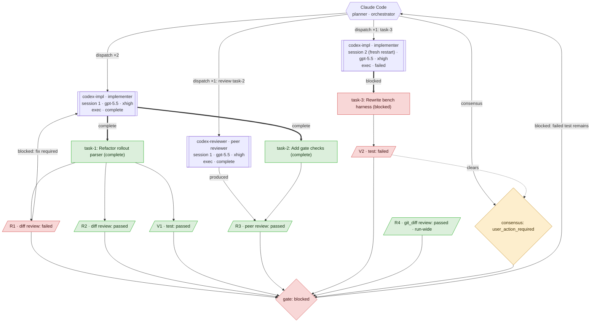

# Orchestration Graph

The generated `## Orchestration Graph` section of every `report.md` is an agentic trace graph
compiled from the run ledger by `scripts/codex_orchestrator/orchestration_graph.py`. It is
deterministic: every node and edge is derived from recorded events, so the picture cannot drift from
what the run actually did.

## Shape Grammar

| Shape | Generated node | Meaning |
| --- | --- | --- |
| Hexagon | `A_CLAUDE{{"Claude Code planner · orchestrator"}}` | Claude control plane (always present when any protocol event exists). |
| Subroutine | `A_<SLUG>[["agent · role session n · model · effort mode · status"]]` | One non-hub Codex **session**. Later fresh restarts get `_S<n>` node ids and a `session n (fresh restart)` label. The `model · effort` line appears only when the dispatch recorded them. |
| Rectangle | `T_<slug>["task_id: compact title (status)"]` | Task artifact from task ledger records. Titles are compacted; ids and status stay visible. |
| Parallelogram | `V<n>[/"Vn · kind: result"/]`, `R<n>[/"Rn · kind review: result"/]` | Evidence that can be inspected, cited, cleared, or replayed. Run-wide review labels append ` · run-wide`. |
| Diamond | `C<n>{"consensus: outcome"}`, `G{"gate: ok"}` | Consensus and gate decisions. |
| Triple circle | `DONE((("run accepted")))` | Accepted terminal state, emitted only when the latest gate passes. |

## Edge Grammar

| Edge | Label(s) | Meaning |
| --- | --- | --- |
| `-->` | `task_created`, `dispatch ×N`, `produced`, positional task-to-evidence links, `consensus`, gate transitions | Transient orchestration action or structural trace link. `task_created` appears only for tasks with no session delivery edge. |
| `==>` | Session-to-task delivery status such as `complete`, `blocked`, or `failed` | State-changing work delivered by a Codex session. |
| `-.->` | `clears` | Read-only citation from rendered evidence to a consensus record. |

Key rules:

- **Dispatch edges collapse to one edge per session** (`dispatch ×N`); a single-dispatch session
  appends the task id (`dispatch ×1: task-3`). A session's *existence* records that it was started
  fresh, so there is no fresh/reuse label on the edge.
- **Evidence is placed between its subject task and the gate** — `T_x --> Vn --> G` or
  `T_x --> Rn --> G`. Run-wide evidence has no task parent and goes straight to `G`.
- **Peer-produced reviews** get a `produced` edge from the reviewer session to the review node;
  reviews authored by Claude have no producer edge (pipeline position is the attribution).
- **Failed reviews loop back** `blocked: fix required` to the session that delivered the reviewed
  task.
- A blocked gate loops back to `A_CLAUDE`; a passing gate points to `DONE`.

The generated graph does **not** emit producer edges from Claude such as `review` or
`add_verification`, and it does **not** emit labeled evidence subject edges such as `reviews` or
`covers` — pipeline position carries the subject.

## Node IDs

| Prefix | Source |
| --- | --- |
| `A_CLAUDE` | Claude control-plane hub; `claude` and `claude-code` reviewer names collapse here. |
| `A_<SLUG>` | First session for a non-hub agent name, uppercased with non-alphanumeric characters changed to `_`; collisions get `_2`, `_3`. |
| `A_<SLUG>_S<n>` | Later fresh session restart for that agent, with the same collision rules. |
| `T...` | Task ids, slugged from `task_created` / task protocol records. |
| `V<n>` | Non-review verification records in ledger order. |
| `R<n>` | Review-kind verifications and typed `review` records in ledger order. |
| `C<n>` | Consensus records in ledger order. |
| `G`, `DONE` | Latest gate result and accepted terminal state. |

## Evidence Cross-References

`V<n>` and `R<n>` ids are assigned in ledger order and are stable within a rendered report. The same
ids appear in the graph **and** in the `## Consensus` detail headings, for example
`- **V1 — Test** (passed)` and `- **R1 — Diff Review** (passed)`. Graph labels stay compact and
carry only the id, kind, result, and optional run-wide suffix; the full summary, command, artifacts,
findings, and notes live in the Consensus details.

## Status Colors

The graph uses three optional classes, assigned by outcome:

| Class | Fill / stroke | Meaning |
| --- | --- | --- |
| `ok` | `#dcefdc` / `#0ca30c` | Passed / completed / accepted outcomes. |
| `attention` | `#fdeecd` / `#b97b00` | Skipped, inconclusive, needs-human-review, user-action-required, unresolved, or other non-final outcomes. |
| `bad` | `#f8d7d7` / `#d03b3b` | Failed, blocked, or rejected outcomes. |

Session nodes and `A_CLAUDE` are neutral and never colored — they are entities, not outcomes. Color
encodes outcome, shape encodes type, and labels always carry the state word, so color never carries
meaning alone. A `classDef` is emitted only when at least one node uses it.

## Worked Example

One run exercising every shape and edge: an implementer session reused for two tasks and a
**second, freshly restarted** implementer session for a third; a **peer-reviewer** session that
*produces* its own review; a failed review that **loops back** to the delivering session; run-wide
evidence with no task parent; a consensus record citing the failed check; and a blocked gate that
returns to Claude.

Reading it:

- **Sessions, not agents.** `codex-impl` appears as two nodes because it was started fresh twice —
  `session 1` (reused for task-1 and task-2, collapsed to one `dispatch ×2` edge) and
  `session 2 (fresh restart)`, which left task-3 blocked. `codex-reviewer` is a separate session
  whose role is inferred from the review it authored.
- **Evidence sits on the path from its task to the gate.** `R1/R2/V1` judge task-1; `V2` judges
  task-3. There is no `reviews`/`covers` label — position is the subject.
- **The fix loop is a cycle.** `R1` failed, so it loops back `blocked: fix required` to the session
  that delivered task-1.
- **Peer attribution is explicit.** `R3` has a `produced` edge from the reviewer session; Claude's
  own reviews (`R1`, `R2`) do not.
- **Run-wide evidence is unparented.** `R4` has no task edge, so it is about the whole run.
- **The gate is the sink.** Every evidence and consensus node feeds `G`; because a check failed, the
  gate is blocked and returns to Claude. When a gate passes instead, `G -->|"ok"| DONE` replaces the
  loop-back and the terminal `run accepted` node appears.
