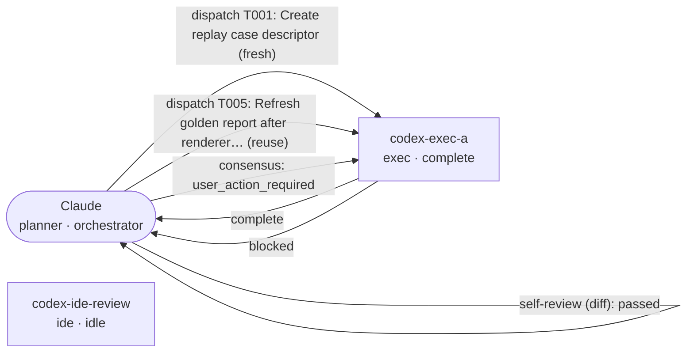

# Report

## Summary

No authored summary recorded.

### Generated Digest

- Run ID: long-run-001
- Status: needs_review
- Generated at: 2026-06-29T09:00:00Z
- Acceptance: No acceptance decision recorded; this run needs review.
- Changes: 10 (8 complete, 1 blocked, 1 failed)
  - Create replay case descriptor
  - Capture session state fixture
  - Assemble ledger task history
  - Implement replay benchmark metrics
  - Refresh golden report after renderer change
  - Validate parser warning propagation
  - Wire benchmark suite dispatcher
  - Add benchmark comparison command
  - Add long workflow report test
  - Document deterministic replay protocol
- Reviews: 2
- Consensus: 1 user action required
- Sessions: 2
- Open items (5):
  - Session codex-ide-review has low parser confidence.
  - Test (failed): Replay smoke test failed on stale parser warning assertion
  - Claude and Codex disagreed on accepting the parser warning risk (user action required)
  - Refresh golden report after renderer change (blocked)
  - Validate parser warning propagation (failed)

## Reproducibility

- Plugin Version: `0.3.0-fixture`
- Plugin Git SHA: `plugin-ref-0.3-fixture`
- Protocol Version: `1.0`
- Schema Version: `1.0`
- Repo Commit: `fixture-repo-commit-001`
- Benchmark Suite: `replay`
- Benchmark Case: `long-run-001`
- Config:
  - session_reuse_policy: `reuse-idle`
  - require_final_codex_review: `True`
  - require_file_claims: `True`

## Changes

No authored changes recorded.

### Ledger Records

- **Create replay case descriptor** (complete)
  - Owner: codex-exec-a
  - Notes: Created the replay case descriptor and deterministic timestamp.
- **Capture session state fixture** (complete)
  - Owner: codex-exec-a
  - Notes: Captured two Codex sessions with exec and IDE modes.
- **Assemble ledger task history** (complete)
  - Owner: codex-exec-a
  - Notes: Assembled run metadata and task ledger events.
- **Implement replay benchmark metrics** (complete)
  - Owner: codex-exec-a
  - Notes: Added deterministic benchmark result metrics.
- **Refresh golden report after renderer change** (blocked)
  - Owner: codex-exec-a
  - Notes: Golden report comparison still needed before release.
- **Validate parser warning propagation** (failed)
  - Owner: codex-ide-review
  - Notes: Initial parser-warning assertion failed and remains documented.
- **Wire benchmark suite dispatcher** (complete)
  - Owner: codex-exec-a
  - Notes: Implemented CLI summary for replay cases.
- **Add benchmark comparison command** (complete)
  - Owner: codex-exec-a
  - Notes: Implemented JSON and JSONL comparison loader.
- **Add long workflow report test** (complete)
  - Owner: codex-ide-review
  - Notes: Added unittest coverage around report risks and final review output.
- **Document deterministic replay protocol** (complete)
  - Owner: codex-exec-a
  - Notes: Kept network and agent calls out of the replay harness.

## Orchestration Graph

Flow: Claude → codex-exec-a dispatch T001 (complete) · Claude → codex-exec-a dispatch T005 (blocked) · Claude self-review diff (passed) · consensus: user_action_required

- **T001**: Create replay case descriptor (complete)
  - Owner: codex-exec-a
  - Files allowed: `bench/cases/replay/long-run-001/case.json`, `bench/cases/replay/long-run-001/state.json`
  - Latest checkpoint: complete - Created the deterministic replay descriptor and state fixture.
  - Files changed: `bench/cases/replay/long-run-001/case.json`, `bench/cases/replay/long-run-001/state.json`
- **T005**: Refresh golden report after renderer change (blocked)
  - Owner: codex-exec-a
  - Files allowed: `bench/cases/replay/long-run-001/ledger.jsonl`, `bench/cases/replay/long-run-001/expected-report.md`
  - Latest checkpoint: blocked - Recorded task protocol events and left the golden refresh blocked for the review gate.
  - Files changed: `bench/cases/replay/long-run-001/ledger.jsonl`, `bench/cases/replay/long-run-001/expected-report.md`

## Consensus

### Verification Checks

- **Test** (failed)
  - Summary: Replay smoke test failed on stale parser warning assertion
  - Command: `python3 -m unittest tests/test_parse.py`
  - Notes: Failure is retained to verify unresolved risks are surfaced in the report.
  - Exit Code: `1`
  - Artifacts:
    - `prompts/test-suite.md`
    - `logs/test-suite.jsonl`

### Reviews

- **Manual / agent review** (passed)
  - Summary: Final Codex review passed with the failed verification documented
  - Command: `codex exec review --fixture long-run-001`
  - Notes: The failed verification is documented as an unresolved risk and should block unattended acceptance.
  - Exit Code: `0`
  - Artifacts:
    - `prompts/final-review.md`
    - `logs/final-review.jsonl`
- **Diff Review** (passed)
  - Reviewer: claude
  - Summary: Typed review passed after checking the refreshed report output.
  - Command: `codex exec review --base main`
  - Prompt: `prompts/typed-review.md`
  - Log: `logs/typed-review.jsonl`

### Decisions

- **Finding:** Claude and Codex disagreed on accepting the parser warning risk
  - **Root Cause:** The IDE session parser reported low confidence after a rollout format change.
  - **Resolution:** Keep the run in needs_review until a human decides whether the parser warning blocks release.
  - **Outcome:** user action required
  - **Risk Level:** medium
  - **Requires User:** yes
  - **Evidence:**
    - Session codex-ide-review has low parser confidence.
    - Manual review verified the failed test remains documented.

## Gate Result

- OK: `false`
- Blocking:
  - failed verification remains
  - user-action consensus item remains
- Warnings: none

## Risks / Follow-ups

- Session codex-ide-review has low parser confidence.
- Test (failed): Replay smoke test failed on stale parser warning assertion
- Claude and Codex disagreed on accepting the parser warning risk (user action required)
- Refresh golden report after renderer change (blocked)
- Validate parser warning propagation (failed)
